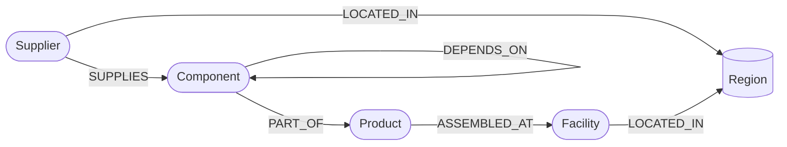
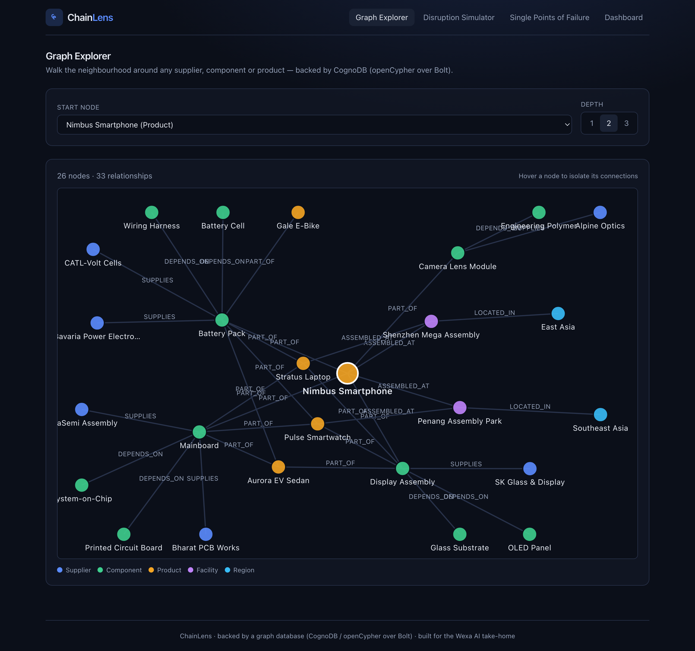
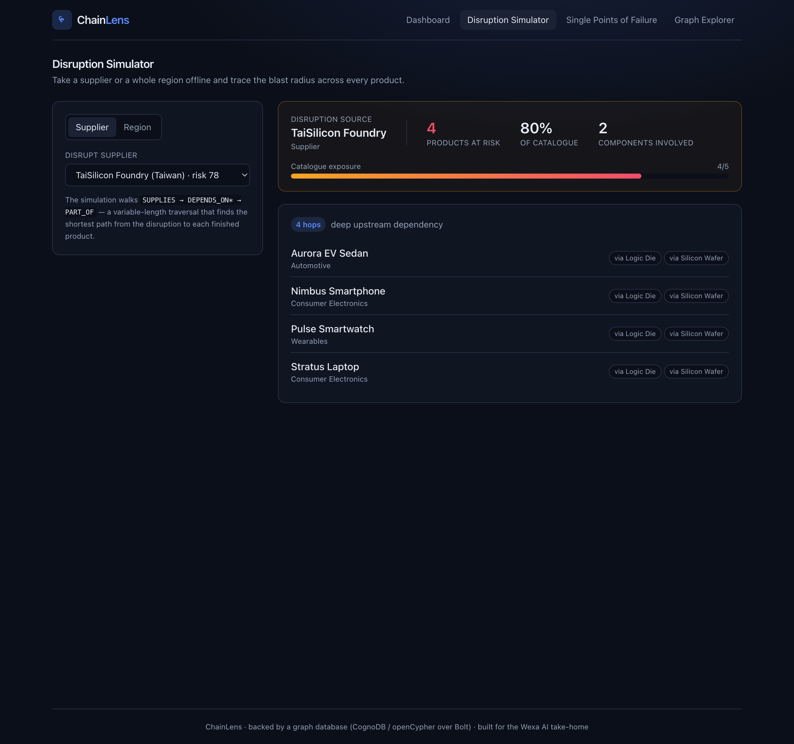
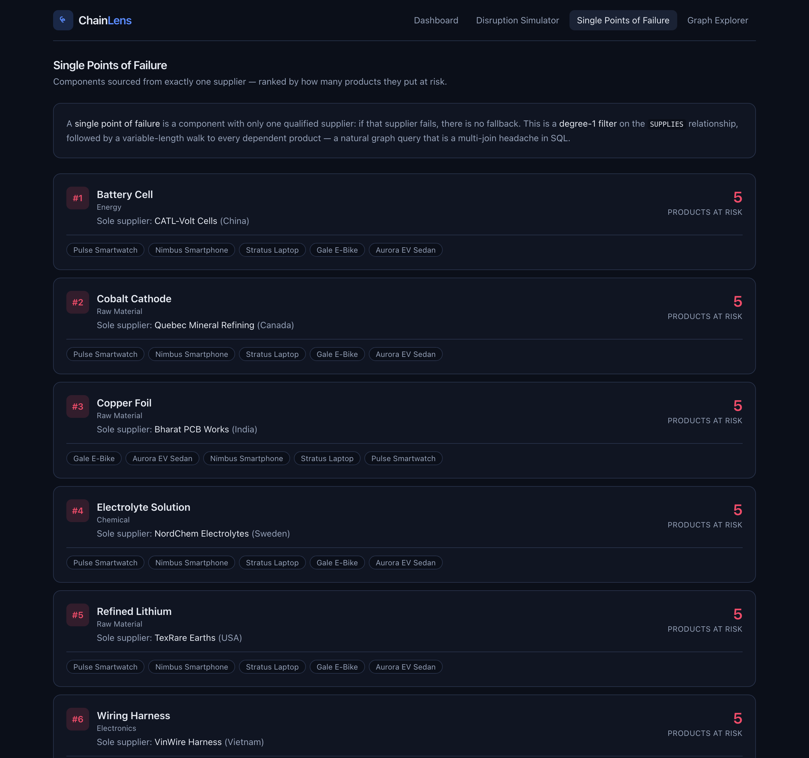
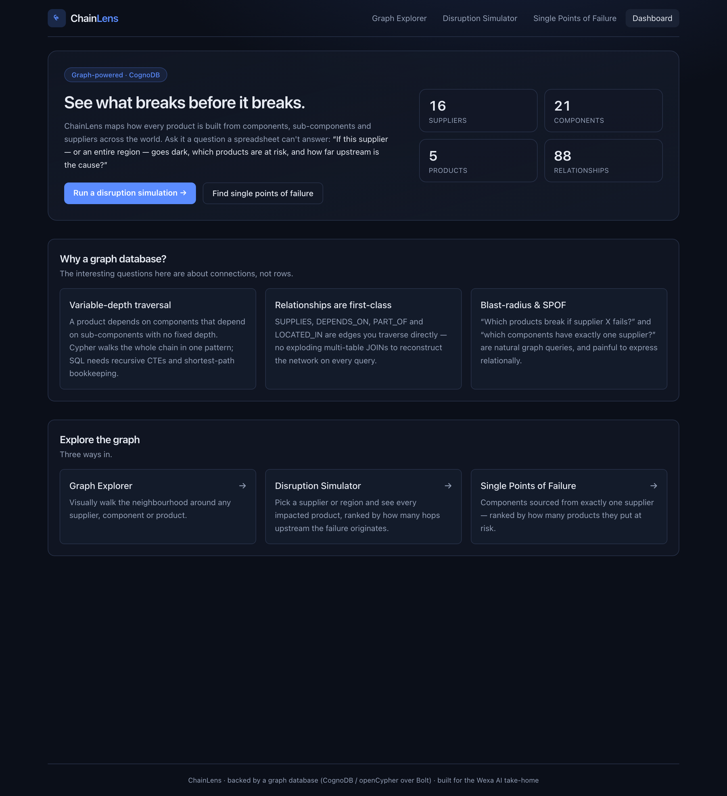

# ChainLens — Supply Chain Impact & Resilience Graph

> A graph-database application that maps how products are built from components and
> suppliers worldwide, and answers the question a spreadsheet can't:
> **"If this supplier — or an entire region — goes offline, which products are at
> risk, and how far upstream is the cause?"**

The data layer is [CognoDB](https://console.cognodb.com) — a managed graph
database that speaks openCypher over the Bolt protocol and works with the
official Neo4j drivers (so it also runs unchanged against a local Neo4j).

**Live demo:** <https://cognodb-supply-graph-seven.vercel.app>
— deployed on Vercel, running against a live CognoDB Cloud instance.

---

## Table of contents

1. [The use case](#the-use-case)
2. [Why a graph database?](#why-a-graph-database)
3. [Data model](#data-model)
4. [The main queries](#the-main-queries)
5. [Screenshots](#screenshots)
6. [Setup & run](#setup--run)
7. [Creating a CognoDB instance](#creating-a-cognodb-instance)
8. [Project structure](#project-structure)
9. [Engineering notes](#engineering-notes)

---

## The use case

Modern products are built from deep, branching supply chains. A smartphone's
mainboard needs a System-on-Chip, which needs a logic die, which needs a silicon
wafer from a single foundry. When one supplier or region is disrupted, the
business question is not "which orders reference this supplier" — it's **"what is
the total blast radius, several hops upstream, across every finished product?"**

**ChainLens** models the supply chain as a graph and provides three tools a
non-technical operations or risk manager can use directly:

- **Disruption Simulator** — take a supplier or a whole region offline and see
  every impacted product, ranked by how many hops upstream the failure starts.
- **Single Points of Failure** — components sourced from exactly one supplier,
  ranked by how many products they endanger.
- **Graph Explorer** — visually walk the neighbourhood around any node.

---

## Why a graph database?

The interesting questions here are about **connections**, not rows. Three
concrete reasons a graph database earns its place over a relational schema:

1. **Variable-depth traversal is native.** A product depends on components that
   depend on sub-components with *no fixed depth*
   (`Supplier -SUPPLIES-> Component -[DEPENDS_ON*]-> Component -PART_OF-> Product`).
   In Cypher this is a single variable-length pattern:
   `MATCH (c0)-[:DEPENDS_ON*0..5]->(cEnd)-[:PART_OF]->(p)`.
   In SQL it requires a **recursive CTE** plus manual bookkeeping to compute the
   shortest hop distance — and the query gets rewritten every time the model
   grows another level.

2. **Relationships are first-class.** `SUPPLIES`, `DEPENDS_ON`, `PART_OF` and
   `LOCATED_IN` are edges you traverse directly. The relational equivalent is a
   pile of join tables and a query plan that explodes combinatorially as you add
   hops. Traversal cost in a graph is proportional to the **result** size, not
   the total table size.

3. **The signature questions are graph-shaped.**
   - *Blast radius:* "which products break if supplier X fails?" → one traversal.
   - *Single point of failure:* "which components have exactly one supplier?" →
     a degree filter on the `SUPPLIES` relationship (`size(suppliers) = 1`),
     then a walk to dependents.
   - *Shortest upstream distance:* `min(length(path))` falls out of the pattern
     match for free.

   Each of these is a multi-join, multi-CTE headache relationally.

---

## Data model

### Node labels

| Label       | Key properties                          | Meaning                                  |
|-------------|-----------------------------------------|------------------------------------------|
| `Supplier`  | `id`, `name`, `country`, `tier`, `riskScore` | A company that supplies components   |
| `Component` | `id`, `name`, `category`                | A part — raw material, sub-assembly, or assembly |
| `Product`   | `id`, `name`, `category`                | A finished, sellable product             |
| `Facility`  | `id`, `name`, `country`                 | An assembly plant                        |
| `Region`    | `id`, `name`, `riskNote`                | A geographic region                      |

### Relationship types

| Relationship               | Meaning                                             |
|----------------------------|-----------------------------------------------------|
| `(:Supplier)-[:SUPPLIES]->(:Component)`   | Supplier provides a component        |
| `(:Component)-[:DEPENDS_ON]->(:Component)`| Bill-of-materials: a part needs a sub-part |
| `(:Component)-[:PART_OF]->(:Product)`     | Top-level component of a product     |
| `(:Product)-[:ASSEMBLED_AT]->(:Facility)` | Where the product is assembled       |
| `(:Supplier)-[:LOCATED_IN]->(:Region)`    | Supplier's geography                 |
| `(:Facility)-[:LOCATED_IN]->(:Region)`    | Facility's geography                 |

### Diagram



The `DEPENDS_ON` self-relationship is the key to the model: it forms a
variable-depth bill-of-materials tree (e.g.
`Battery Pack → Battery Cell → Refined Lithium`).

---

## The main queries

All queries live in [`src/lib/queries.ts`](src/lib/queries.ts) and are **fully
parameterised** — values are passed to the driver as a params object (`$name`),
never concatenated into the Cypher string.

### 1. Supplier disruption — multi-hop traversal *(the flagship query)*

Find every product transitively depending on a supplier, with the shortest hop
distance:

```cypher
MATCH (s:Supplier {id: $supplierId})-[:SUPPLIES]->(c0:Component)
MATCH path = (c0)<-[:DEPENDS_ON*0..5]-(cEnd:Component)-[:PART_OF]->(p:Product)
WITH s, p, min(length(path)) AS hops, collect(DISTINCT c0.name) AS viaComponents
RETURN s.name AS supplierName, p.id AS pid, p.name AS pname, p.category AS pcat,
       hops, viaComponents
ORDER BY hops ASC, pname ASC
```

The `DEPENDS_ON*0..5` is the variable-length traversal. An assembly
`DEPENDS_ON` its sub-parts, so from a supplied part we follow `DEPENDS_ON`
*incoming* (`<-`) up the bill-of-materials to the assembly that is finally
`PART_OF` a product. **This is the query a relational database finds awkward** —
it needs a recursive CTE plus a manual shortest-path aggregation.

### 2. Region disruption — multi-hop across four relationship types

Same idea, but starts from every supplier in a region:
`Region <-LOCATED_IN- Supplier -SUPPLIES-> Component <-DEPENDS_ON*- Component -PART_OF-> Product`.

### 3. Single points of failure — degree filter + traversal

```cypher
MATCH (c:Component)<-[:SUPPLIES]-(s:Supplier)
WITH c, collect(DISTINCT s) AS suppliers
WHERE size(suppliers) = 1
WITH c, head(suppliers) AS sole
OPTIONAL MATCH (c)<-[:DEPENDS_ON*0..5]-(:Component)-[:PART_OF]->(p:Product)
RETURN c.name AS componentName, sole.name AS soleSupplier,
       size(collect(DISTINCT p)) AS dependentProductCount
ORDER BY dependentProductCount DESC
```

### 4. Neighbourhood subgraph — for the visual explorer

A parameterised variable-length walk (`(start)-[*1..3]-(other)`) bounded by a
`$depth` parameter, returning one row per edge for the SVG renderer.

---

## Screenshots

Screenshots live in [`docs/`](docs/).

### Graph Explorer — interactive neighbourhood visualisation (landing page)


### Disruption Simulator — blast radius of a supplier failure, grouped by hop distance


### Single Points of Failure — components with a sole supplier, ranked by products at risk


### Dashboard — live graph stats + "Why a graph database?"


---

## Setup & run

### Prerequisites

- Node.js 18+ (tested on Node 20)
- A graph database endpoint — either a **CognoDB Cloud** instance (see below) or
  a local Neo4j for development.

### 1. Install

```bash
npm install
```

### 2. Configure connection secrets

Copy the example env file and fill in your connection details. **`.env.local` is
git-ignored and must never be committed.**

```bash
cp .env.example .env.local
```

```dotenv
# CognoDB Cloud:
NEO4J_URI=bolt+s://<instance-id>.databases.cognodb.cloud
NEO4J_USERNAME=cognodb
NEO4J_PASSWORD=<your-saved-password>
NEO4J_DATABASE=neo4j
```

For **local development with Docker Neo4j** instead:

```bash
docker run -d --name neo4j-local -p 7687:7687 -p 7474:7474 \
  -e NEO4J_AUTH=neo4j/testpassword123 neo4j:5.20
```

```dotenv
NEO4J_URI=bolt://localhost:7687
NEO4J_USERNAME=neo4j
NEO4J_PASSWORD=testpassword123
```

### 3. Verify the connection

```bash
npm run check-db
```

### 4. Seed the graph

```bash
npm run seed
```

Loads ~50 nodes and ~70 relationships (suppliers, components, products,
facilities, regions).

### 5. Run

```bash
npm run dev          # http://localhost:3000
# or, production:
npm run build && npm run start
```

---

## Creating a CognoDB instance

1. Sign up at **https://console.cognodb.com/signup** (free tier, no credit card).
2. Create a free **c0** instance and pick a region — it provisions in under a
   minute.
3. Copy the connection URI (`bolt+s://<instance-id>.databases.cognodb.cloud`),
   username `cognodb`, and the generated password. **The password is shown
   exactly once — save it immediately.**
4. Put those values in `.env.local` (step 2 above) and run `npm run seed`.

> **Free-tier sizing:** the c0 instance is 0.5 vCPU / 256 MB RAM / 1 GB disk.
> This dataset (~50 nodes) sits comfortably inside those limits.

---

## Deployment

The app is a standard Next.js project and deploys to any Node host. On **Vercel**
(free tier):

1. Push this repo to GitHub and import it in Vercel.
2. In **Project → Settings → Environment Variables**, add `NEO4J_URI`,
   `NEO4J_USERNAME`, `NEO4J_PASSWORD`, `NEO4J_DATABASE` pointing at your CognoDB
   instance (use the `bolt+s://` URI — TLS is required for CognoDB Cloud).
3. Deploy. The build command is `next build` (default). No further config needed.
4. Seed the CognoDB instance once from your machine with `npm run seed` (the seed
   script reads the same env vars from `.env.local`).

This project is deployed at <https://cognodb-supply-graph-seven.vercel.app>.

> Keep the CognoDB instance running so the live demo works against real data.

---

## Project structure

```
cognodb-supply-graph/
├─ src/
│  ├─ app/
│  │  ├─ page.tsx              # Graph Explorer (landing page)
│  │  ├─ simulate/page.tsx     # Disruption Simulator
│  │  ├─ risk/page.tsx         # Single Points of Failure
│  │  ├─ dashboard/page.tsx    # Dashboard + "Why a graph database?"
│  │  └─ api/                  # Route handlers (stats, suppliers, impact, spof, graph, health)
│  ├─ components/              # NavBar, GraphView (SVG), UI primitives
│  └─ lib/
│     ├─ env.ts               # Validated env-var access (secrets)
│     ├─ neo4j.ts             # Driver singleton + typed error handling
│     ├─ queries.ts           # All parameterised Cypher
│     ├─ api.ts               # Consistent API error envelope
│     ├─ types.ts             # Shared domain types
│     └─ useApi.ts            # Client fetch hook (loading/error states)
├─ scripts/
│  ├─ data.ts                 # Seed dataset
│  ├─ seed.ts                 # Parameterised loader (npm run seed)
│  └─ check-connection.ts     # Connectivity check (npm run check-db)
├─ .env.example               # Copy to .env.local
└─ README.md
```

---

## Engineering notes

- **Secrets from env only.** All connection details come from environment
  variables via `src/lib/env.ts`, which validates them and throws a clear error
  if any are missing. `.env*` files are git-ignored.
- **Parameterised queries everywhere.** No user value is ever concatenated into
  Cypher. Node labels / relationship types in the seed loader are hard-coded
  identifiers (Cypher cannot parameterise those), while every *value* is passed
  as a parameter.
- **Graceful DB-unreachable handling.** `src/lib/neo4j.ts` normalises driver and
  network errors into a typed `DatabaseUnavailableError`; API routes map it to a
  `503` with a friendly message, and the UI renders a dedicated "database
  unavailable" state with a retry button. Connection timeouts are capped at 10s
  so the app fails fast instead of hanging.
- **Driver as a singleton.** The Neo4j driver manages its own connection pool and
  is created once and cached on `globalThis` (safe across Next.js hot-reloads),
  keeping well under CognoDB's 200-connection free-tier limit.
- **Portable Cypher.** No APOC or Neo4j-only procedures are used, so the same
  queries run unchanged on CognoDB and vanilla Neo4j.

---

## License

MIT.
